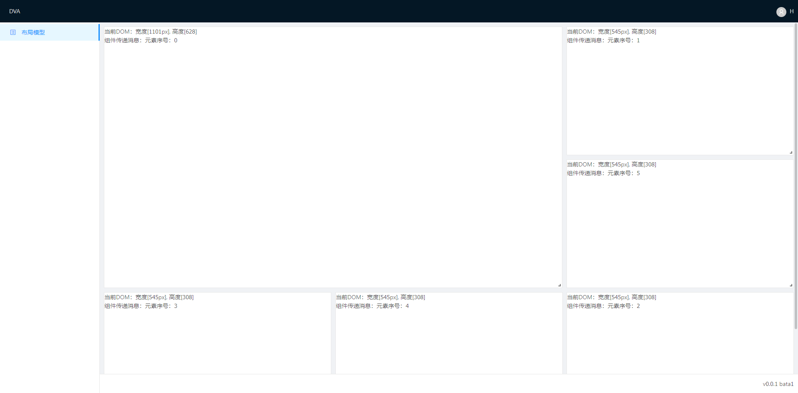
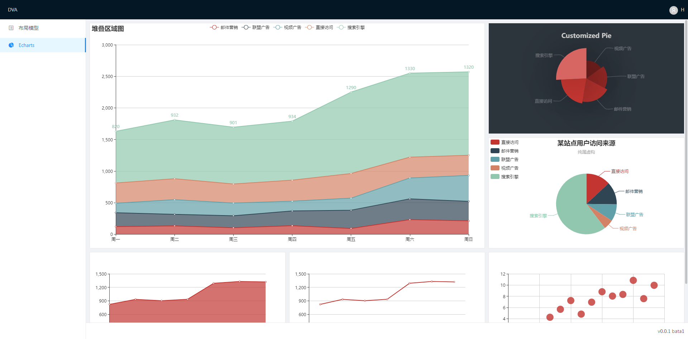

# datav-learn

学习数据可视化

## 目录

- [初始化项目](https://github.com/huang6349/dva-learn)

## 自适应流布局

## Echarts

## 相关教程

- [官网 - DvaJS](https://dvajs.com/)
- [官网 - Ant Design](https://ant.design/index-cn)
- [官网 - react](https://reactjs.org)
- [中文网 - react](https://doc.react-china.org)
- [Github - DvaJS](https://github.com/dvajs/dva)
- [Github - roadhog](https://github.com/sorrycc/roadhog)

## 开源协议

[MIT](https://tldrlegal.com/license/mit-license)
